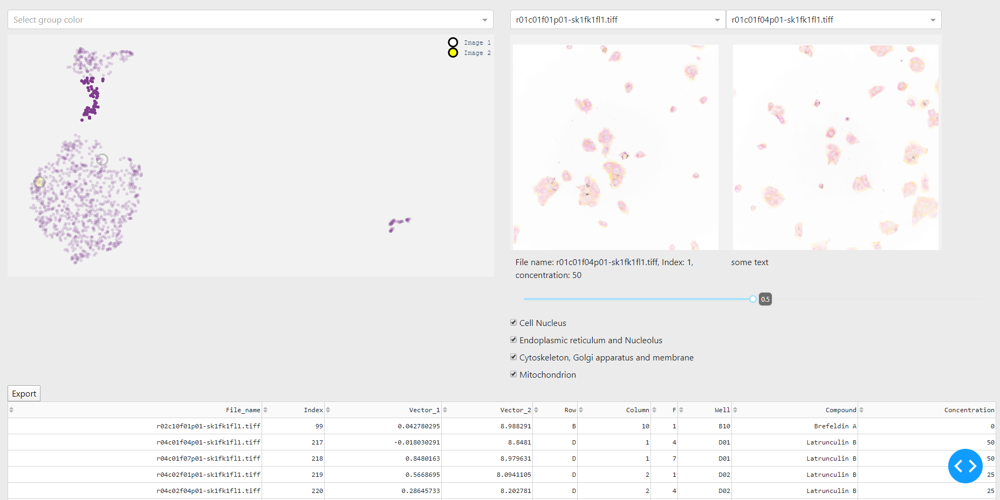
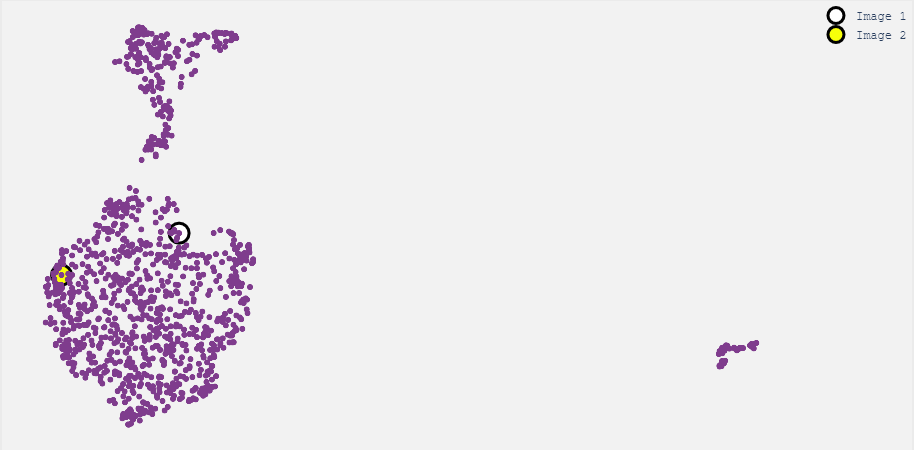
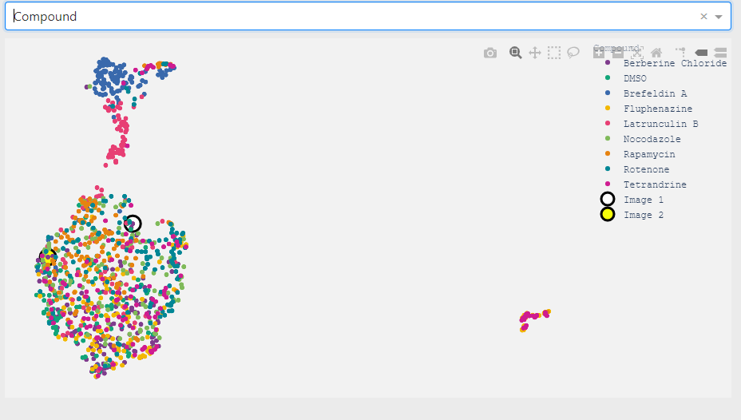
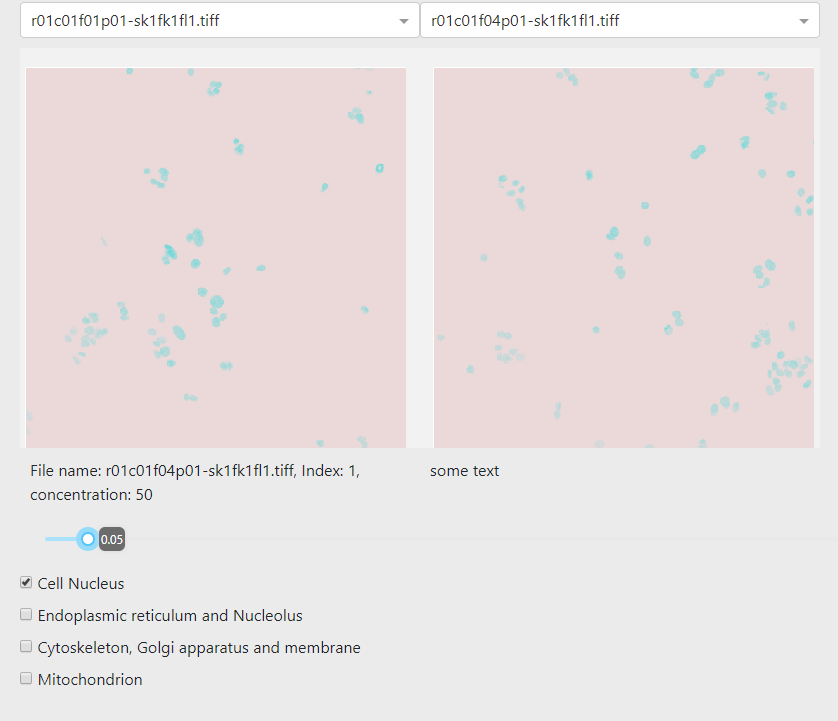
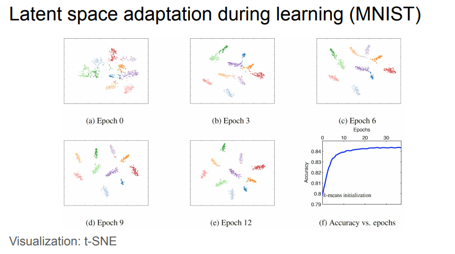

# Authors:
 - Kajetan Kubik
 - Bartosz Maślanka
 
 # State for end Project Classes 1
Look dev branch.
## Pipeline
    1) Take values(our features) from some model penultimate layer. (Here from vgg19)
    2) Put them into UMAP
 
As long as we take only these images, where a high concentration of compound was used, this was enough, but when we take all images, our results become blurred. 

## Tested Method
- We try different pretrained models for future generations(vgg's, resnets, mobilenets), and vgg was best in terms of quality/time
- We try to take model from [our cousines](https://github.com/Mikikrus/CellPainting-AI/tree/develop), because they train models on same datasets that we want to visualize, so we could expected that their model give us better results. BUT predictions take too much time + some classical problem with pytorch.
- We try UMAP and t-SNE as projections method (and even combine them with PCA), and even after some hyperparameter tuning, the results was unsatisfying.

## Finnal Dashboard

 # Future ideas

- Our current results give something more or less like sorting by amount of non-white in the image. If we understand correctly, this is probably not enough, because we want to know the amount cell's in the image and their average size. Obvious solution: image segmentation. But here was the problem: these cells are too connected for this. BUT we observed that we could take just the first channel of the image(cell nucleus), and run segmentation on them(but it was too late).

- At the beginning we tried different methods of taking features (or even different approaches (my favorite: siamese network)), and one of the most promising ones(in our minds) was Varational AE. But we have to train it. And we do not have this kind of computational power. (we should try to first learn on 112x112, then 224x224, check if results is at least as good as with current method, and only then try to go in higher dimensions).

- We too late learned that we could do something named latent space adaptation. And this is gas. And if we return, we should beg from this.

